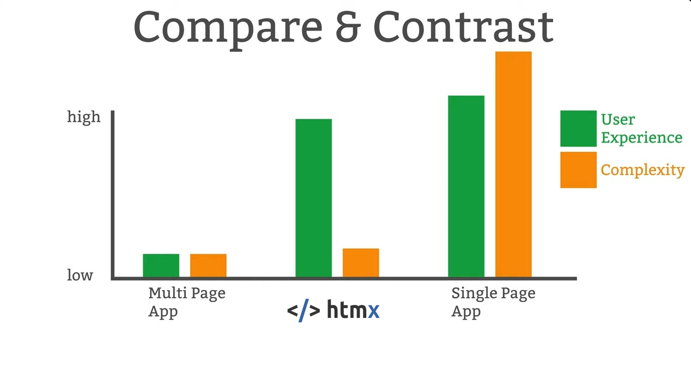

---
# You can also start simply with 'default'
theme: default
# random image from a curated Unsplash collection by Anthony
# like them? see https://unsplash.com/collections/94734566/slidev
# background: https://cover.sli.dev
# some information about your slides (markdown enabled)
title: 実践htmx入門
info: |
  ## Slidev Starter Template
  Presentation slides for developers.

  Learn more at [Sli.dev](https://sli.dev)
# apply unocss classes to the current slide
class: text-center
# https://sli.dev/features/drawing
drawings:
  persist: false
# slide transition: https://sli.dev/guide/animations.html#slide-transitions
transition: slide-left
# enable MDC Syntax: https://sli.dev/features/mdc
mdc: true
---

# 実践htmx入門

<!--
The last comment block of each slide will be treated as slide notes. It will be visible and editable in Presenter Mode along with the slide. [Read more in the docs](https://sli.dev/guide/syntax.html#notes)
-->

---

# 自己紹介

- @kimihito
- 株式会社ミノタケ (4月で12周年)
- https://x.com/kimihito_
- https://github.com/kimihito

* 好きなもの:
  * （今どきじゃない）フルスタックWebフレームワーク
    * Django (+ Alpine.js, htmx )
    * Rails (+ Hotwire)
    * Phoenix (+ Phoenix Liveview)
---
class: text-center
layout: cover
---

# AIの話しません
# Gammaもつかってません

---
class: text-center
layout: cover
---

# htmxの話をしにきました

興味ないならまだご飯残っています、ご歓談ください

---
class: text-center
layout: cover
---

# 基本編

---

# htmxとは

- https://htmx.org
- HTML拡張のためのライブラリ（**htm**l e**x**tensions）
- HTMLにインタラクティブ性を付加する新しいアプローチ
- シンプルな属性ベースのAPI

## htmxの誤解

* JavaScriptを書かなくていいとはいってない

---

# htmxの基本コンセプト

```html
<button hx-post="/clicked"
        hx-trigger="click"
        hx-target="#result"
        hx-swap="outerHTML">
  クリックしてください
</button>

<div id="result"></div>
```

- `hx-post`: HTTPメソッドと送信先
- `hx-trigger`: イベントの種類
- `hx-target`: 結果の反映先
- `hx-swap`: DOM更新方法

---
class: text-center
layout: cover
---

# 実践編

やってみてよかったことを紹介


---

# **実践例1:** Alpine.jsとの組み合わせ

```html
<form x-data="{ submitting: false }"
      hx-post="/api/submit"
      hx-indicator="#spinner"
      @htmx:before-request="submitting = true"
      @htmx:after-request="submitting = false">

  <input type="text" name="username" required>

  <button type="submit"
          :disabled="submitting"
          x-text="submitting ? '送信中...' : '送信する'">
  </button>

  <span id="spinner" class="htmx-indicator">
    処理中...
  </span>
</form>
```

- htmx: サーバーとの非同期通信を担当
- Alpine.js: UI状態（送信中状態）を管理
- イベント連携: htmxのイベントをAlpine.jsでキャッチ

---

## **実践例2:** リクエストの間引き

```html
<!-- 入力が止まって300ms経過後にリクエスト -->
<input type="text"
       name="search"
       hx-get="/search"
       hx-trigger="keyup delay:300ms"
       hx-target="#search-results">

<!-- 最大でも2秒に1回だけリクエスト -->
<div hx-get="/api/status"
     hx-trigger="every 2s throttle:2000ms">
  ステータス更新中...
</div>
```

- `delay`: 入力が止まってから指定時間後に実行（デバウンス）
- `throttle`: 指定時間内は1回だけ実行（スロットリング）

---
layout: two-cols-header
---

## **実践例3:** サーバーからイベント

::left::

```html
<div
  x-data="{ messages: [] }"
  @showMessage.window="
    this.messages.push({
      text: $event.detail.value,
      time: new Date()
    })
  ">

  <div class="notifications">
    <template x-for="msg in messages" :key="msg.time">
      <div class="toast" x-text="msg.text"></div>
    </template>
  </div>

  <div hx-get="/api/notifications"
       hx-trigger="every 10s"
       hx-target="#notification-area">
    最新のお知らせ
  </div>

  <div id="notification-area"></div>
</div>
```

::right::

サーバーからのレスポンス:

```
HTTP/1.1 200 OK
HX-Trigger: {"showMessage": "新しい通知があります"}
Content-Type: text/html

<div>更新された通知内容...</div>
```

---

## htmxの立ち位置（感想）

出典: [u/Abhilash26 on r/htmx](https://www.reddit.com/r/htmx/comments/1arfus7/this_is_why_i_use_htmx/)



---

# まとめ

- htmxは**HTMLを拡張**して動的UIを実現
- **アトリビュートベース**で直感的
- **他のJSライブラリとの組み合わせ**で表現力UP
- **HX-*ヘッダー**でサーバーからクライアントを制御

<div class="mb-10"></div>

# 参考リソース

- 公式サイト: [htmx.org](https://htmx.org/)
- ドキュメント: [htmx.org/docs](https://htmx.org/docs/)
- GitHub: [github.com/bigskysoftware/htmx](https://github.com/bigskysoftware/htmx)

---
layout: cover
---

# おしまい
ご清聴ありがとうございました

---
layout: cover
---

あまったら余談

---
---

# Node.prototype.moveBefore() がおもしろい！！！

htmxの作者やReact、Angularが推進していたAPI

https://github.com/whatwg/dom/issues/1255

https://htmx.org/examples/move-before/

Chrome 133（今月リリース）で有効になってます

---
---

# The future of htmx というエッセイがおもしろい

https://htmx.org/essays/future/

* 次のjQueryをめざす
* 安定こそ機能である
* 機能追加はしない

などなど。おもしろいです
